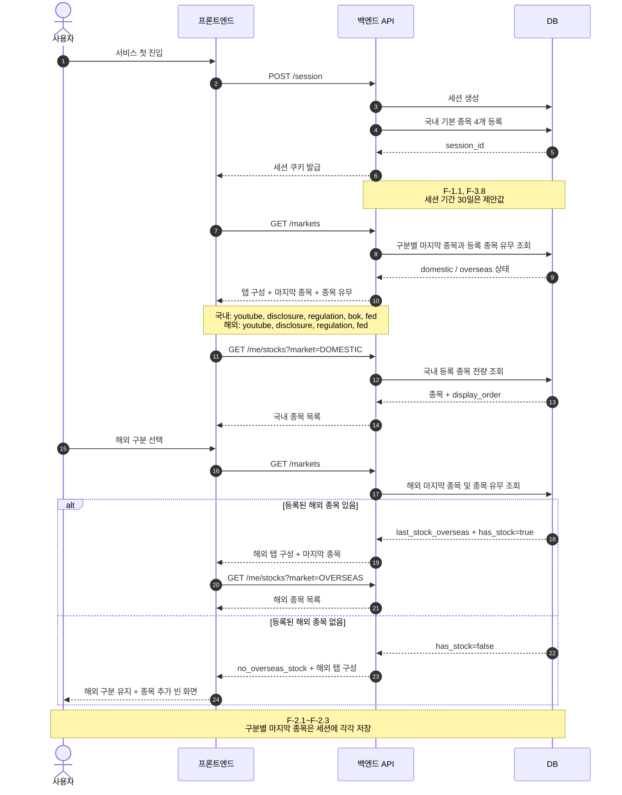
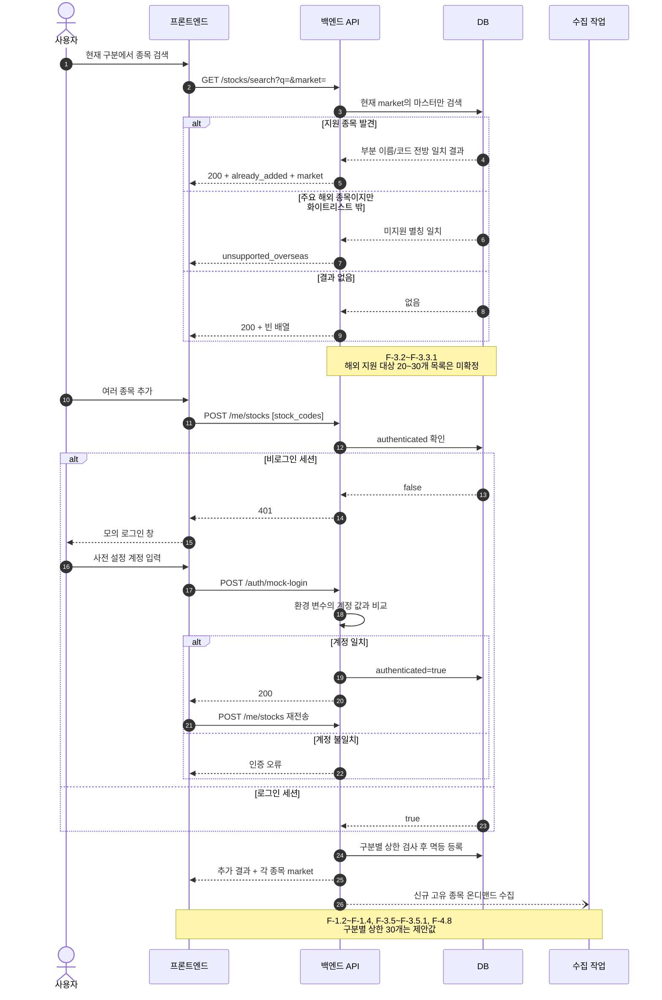
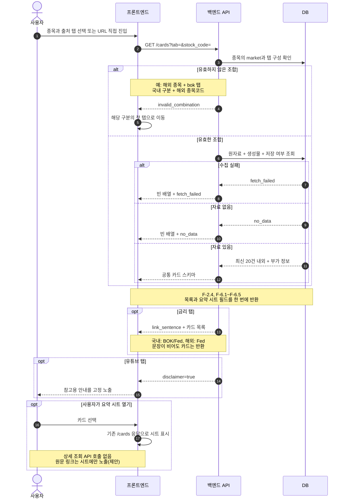
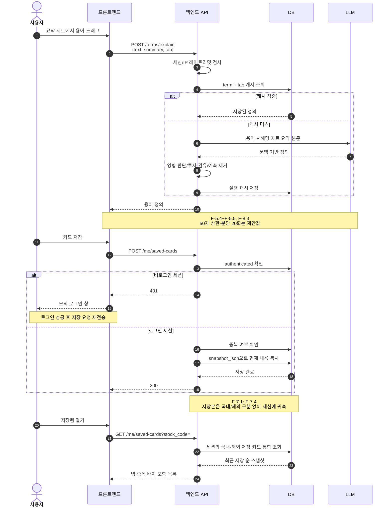
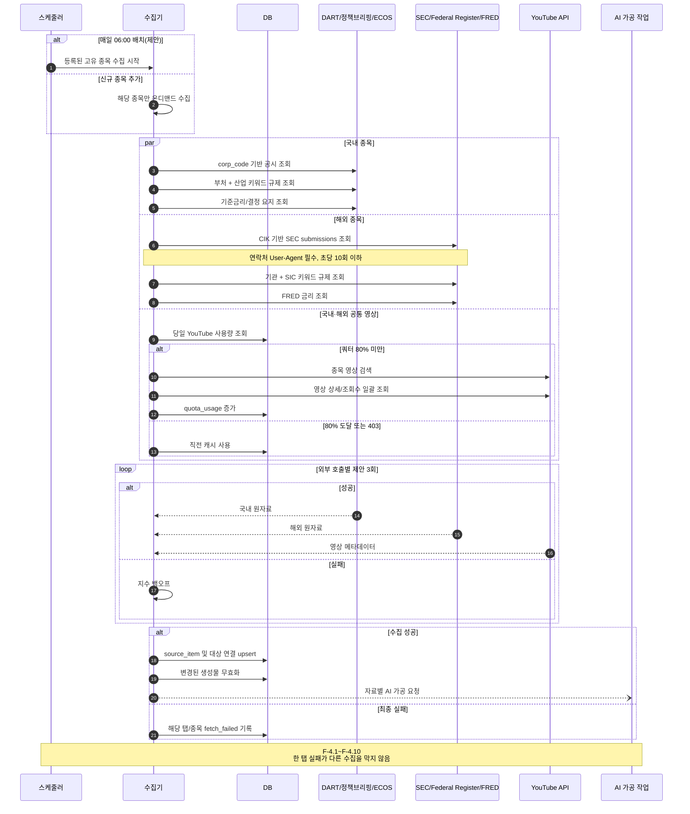
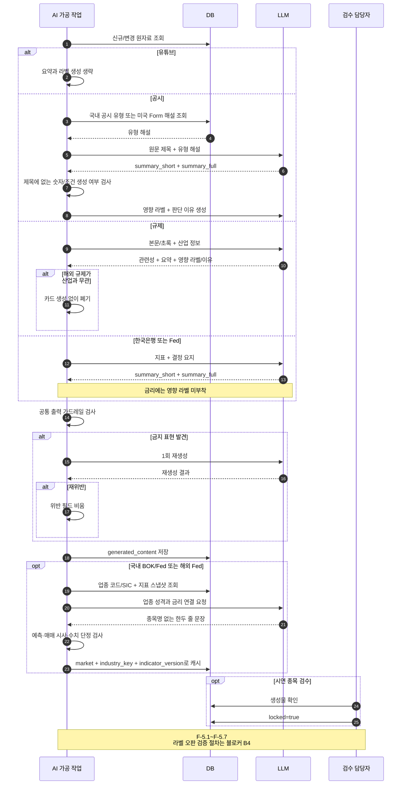
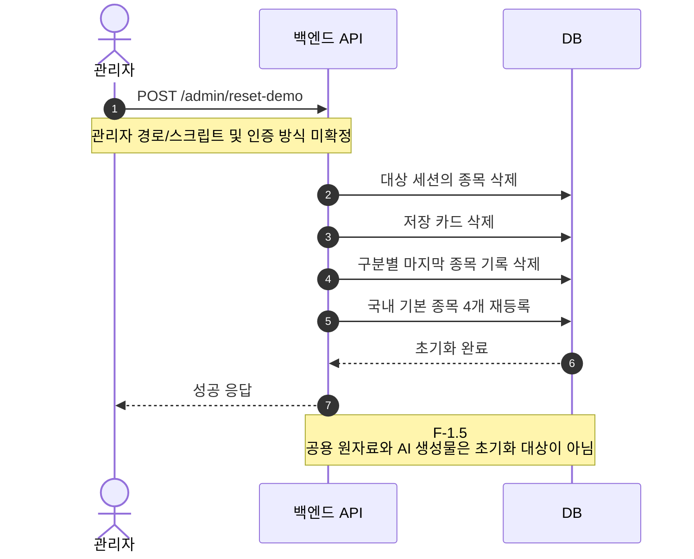

# assit 시퀀스 다이어그램

기준: `assit 요구사항 명세서 (백엔드)` - 국내/해외 4층 구조 반영본

> 표기 규칙: 명세서에서 아직 확정되지 않은 값은 다이어그램의 `Note`에 **미확정/제안**으로 표시한다.

## 1. 첫 진입과 국내/해외 구분 전환

## 2. 종목 검색, 모의 로그인, 종목 추가

## 3. 카드 목록 조회와 유효하지 않은 조합 처리

## 4. 용어 풀이와 카드 저장

## 5. 정기 배치와 국내/해외 데이터 수집

## 6. AI 요약, 영향 라벨, 금리 연결 문장

## 7. 데모 데이터 초기화

## 착수 전 반드시 확정할 항목

- B1: 국내 종목 마스터 데이터 출처
- B2: 국내 업종 분류 체계
- B3: ECOS 통계표 코드와 금통위 결정 요지 텍스트 확보 경로
- B4: 영향 라벨 오판 검증 절차
- 해외 화이트리스트 종목, 공시 Form, 규제 문서 유형과 기관 매핑표
- 데모 초기화 노출·인증 방식

