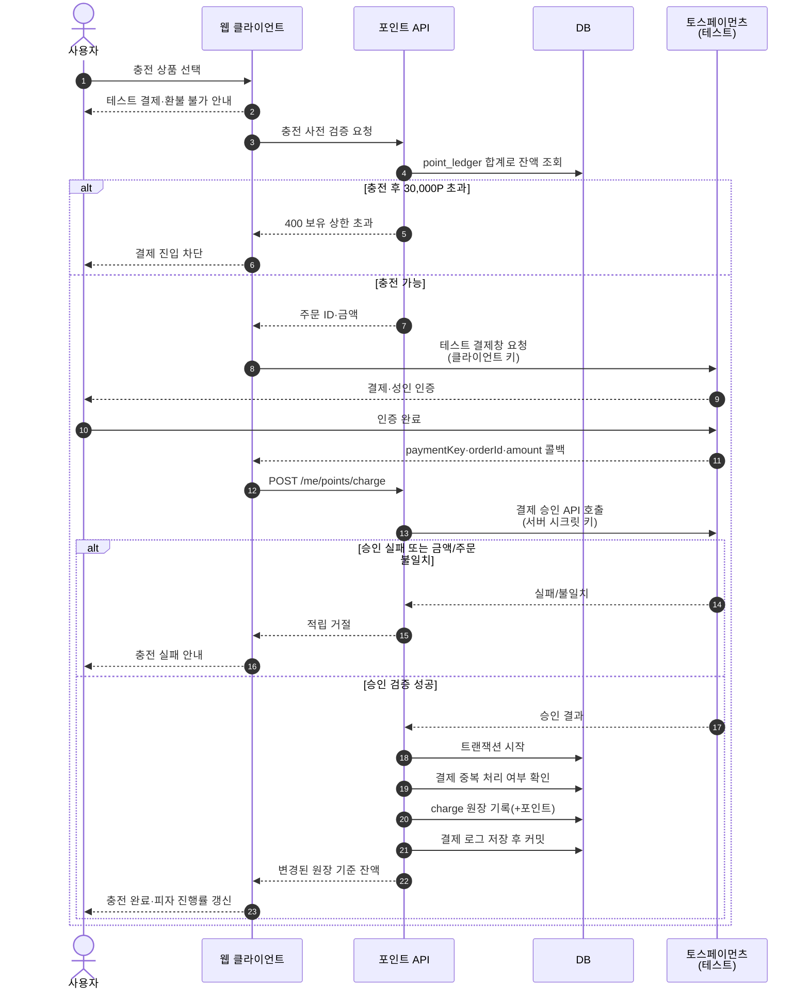
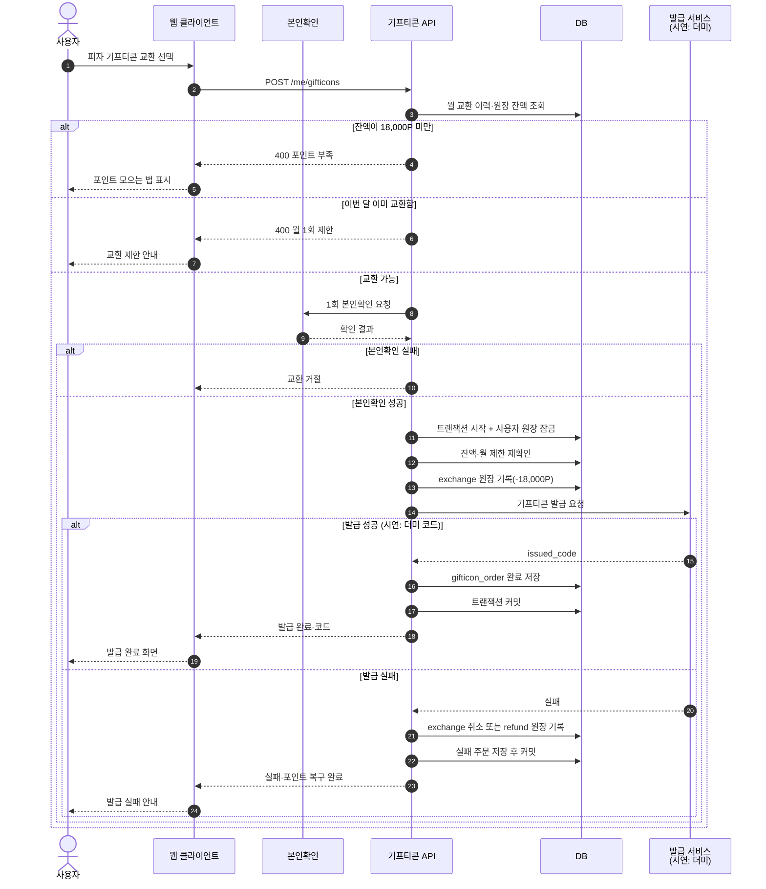
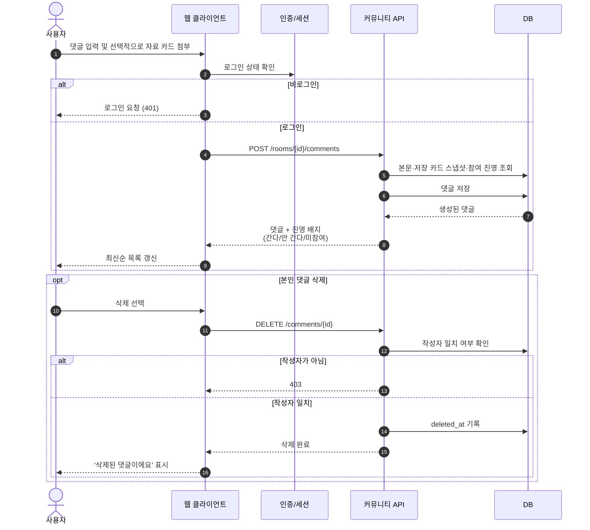

                    API-->>JOB: 다음 시각 재시도 예약
                else 3회 모두 실패
                    API->>DB: 트랜잭션 시작
                    API->>DB: 모든 참가자 refund 원장 기록
                    API->>DB: 상태를 void로 변경
                    API->>DB: 트랜잭션 커밋
                    API-->>JOB: 무효·전액 반환 완료
                end
            end
        end
    end
```

## 5. 테스트 결제 포인트 충전



## 6. 피자 기프티콘 교환



## 7. 댓글 작성 및 삭제



## 구현 시 공통 원칙

- 잔액은 `point_ledger` 합계만을 기준으로 계산한다.
- 베팅·정산·교환은 잔액 확인과 원장 기록을 하나의 트랜잭션으로 묶는다.
- 정산은 방 상태를 잠그고 재확인하여 중복 실행을 방지한다.
- 공개 조회는 인증 없이 허용하고 생성·참여·댓글 작성·충전·교환에서 인증을 요구한다.
- 정산값은 TradingView가 아니라 FinanceDataReader를 기준으로 하며, 실제 사용 종가를 `settle_close_price`에 남긴다.